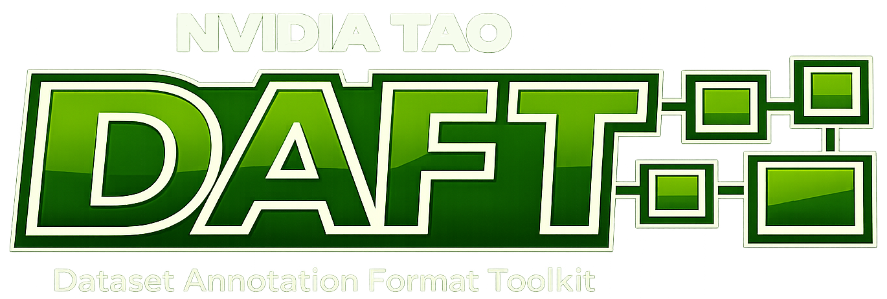

# NVIDIA TAO DAFT: Dataset Annotation Format Toolkit

<p align="center">
  <a href="https://github.com/NVIDIA-TAO/tao-daft/releases"></a>
  <a href="https://www.apache.org/licenses/LICENSE-2.0"></a>
  <a href="https://www.python.org/"></a>
</p>

<p align="center">
  
</p>

A toolkit for vision-language dataset formats — JSON-schema specs plus
CLI/Python tools to validate and convert between them.

## Overview

VLM dataset workflows have a contract-drift problem. Annotation pipelines
emit data in one shape, training pipelines expect another, and the glue
between them is ad-hoc adapter code that silently goes stale. Field
renames, new optional values, schema-vs-data mismatches — these surface as
training-time bugs rather than at the producer / consumer boundary where
they belong.

**What DAFT is:**

- **Schemas** for vision-language dataset shapes — both annotation (what producers emit) and training (what consumers expect).
- A **CLI + validator** so anyone holding a dataset can check it against its schema before handing it off.
- **Converters** between annotation and training shapes — explicit, deterministic, with optional flags for media handling.
- A **reference Python adapter** that plugs one of the training shapes into cosmos-rl SFT.

New formats, validators, converters, and adapters are welcome; the same
registration pattern that wires the built-ins works for your own extensions.

**Value, by audience:**

| For… | DAFT gives you… |
|------|-----------------|
| **Producers** (annotation pipelines, human annotators) | Target one of these schemas and your output is consumable by any downstream tool that speaks the same schema. |
| **Consumers** (training pipelines, researchers) | Validate your input dataset before launching a training run. If it passes, your loader contract holds. |

## Quick start

```bash
# Install (direct from git)
pip install git+https://github.com/NVIDIA-TAO/tao-daft.git

# Install (from wheel)
pip install nvidia-tao-daft

# Verify
tao-daft --help
```


For runnable examples, see [`examples/`](examples/README.md) and the
[CLI reference](src/nvidia_tao_daft/cli/README.md).

## Documentation

| Area | What's there | Link |
|------|--------------|------|
| **Formats** | Format registry, per-format specs (metropolis-v3.0, cosmos-reason-v1.0, tao-vl-reason-v1.0), versioning policy | [formats](src/nvidia_tao_daft/formats/README.md) |
| **CLI** | `tao-daft validate` / `convert` reference | [cli](src/nvidia_tao_daft/cli/README.md) |
| **Validators** | Validation engine | [validators](src/nvidia_tao_daft/validators/README.md) |
| **Converters** | Conversion pairs and pair-specific options | [converters](src/nvidia_tao_daft/converters/README.md) |
| **Datasets** | Training-loop adapters (cosmos-rl) | [datasets](src/nvidia_tao_daft/datasets/README.md) |
| **Examples** | Working datasets per format | [examples](examples/README.md) |

## Repository structure

```
nvidia-tao-daft/
├── examples/datasets/        # Working datasets, one subdir per format
│
├── tests/                    # Test suite (schemas, validators, converters, CLI, doc consistency)
│
└── src/nvidia_tao_daft/
    ├── cli/                  # tao-daft entry point (validate, convert)
    ├── formats/              # Format specifications + JSON schemas
    ├── validators/           # Validation engine
    ├── converters/           # Format converters (pairs/)
    └── datasets/             # Training-loop adapters
```

## Requirements

Python 3.10 – 3.13. Runtime dependencies: `jsonschema`, `pydantic`.
Dev dependencies: see [`pyproject.toml`](pyproject.toml).

## Contributing

See [`CONTRIBUTING.md`](CONTRIBUTING.md) for the DCO sign-off requirement.
## License

[Apache 2.0](LICENSE).


