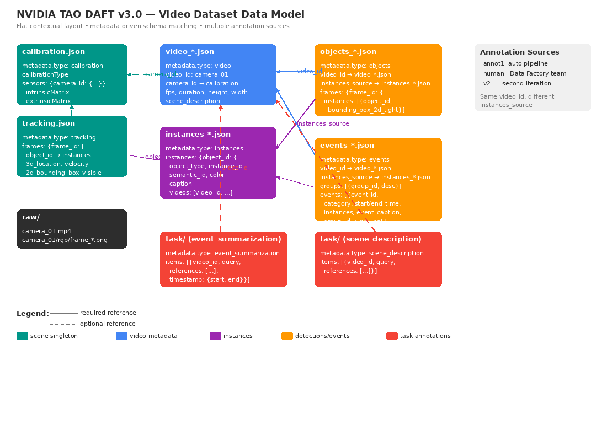

# metropolis-v3.0

**Status**: 🚧 Active Development

The source annotation format for TAO DAFT. A **scene** is a directory holding
raw media plus `contextual/` and `task/` JSON files. A **dataset** is a
recursive tree of any depth containing one or more scenes — the validator
walks the tree and aggregates results.

```
<dataset>/
└── <scene>/
    ├── raw/            # media files
    ├── contextual/     # scene / video context, instances, events, ...
    └── task/           # training samples, one file per task type
```

## Key concepts

- **Files are linked by id, not by directory hierarchy.** All contextual files
  sit directly in `contextual/`. Cross-references go through fields like
  `video_id`, `instances_source`, `object_id`, `camera_id`.
- **Schema dispatch keyed on `metadata.type`.** Every JSON file carries a
  `metadata` block; the validator picks the schema by reading `metadata.type`,
  not by filename. Filenames are free-form.
- **Multiple annotation runs coexist.** Different runs for the same scene
  (e.g. auto-pipeline + human review + later iteration) live side-by-side in
  the same `contextual/`, distinguished by a filename suffix: `_annot1`,
  `_human`, `_v2`, etc.
- **Event groups.** Events can be clustered into named groups via a
  top-level `groups[]` array and per-event `group_id`.

Every file shares the same envelope:

```json
{
  "version": "metropolis-v3.0",
  "metadata": {
    "type": "events",
    "date": "2026-03-25",
    "description": "Event annotations from auto pipeline",
    "license": "...",
    "tags": ["transportation", "auto-pipeline"]
  },
  ...
}
```

## Contextual schemas

Mandatory `metadata` block; schema dispatch keyed on `metadata.type`.

| Schema | `metadata.type` | Scope | Notable fields / cross-references |
|--------|-----------------|-------|------------------------------------|
| [calibration](schemas/contextual/calibration.schema.json) | `calibration` | Per-scene singleton | sensor intrinsics / extrinsics |
| [tracking](schemas/contextual/tracking.schema.json) | `tracking` | Per-scene singleton | → instances (object_id), → calibration (camera_id) |
| [video](schemas/contextual/video.schema.json) | `video` | Per-video | → calibration (camera_id, optional) |
| [image](schemas/contextual/image.schema.json) | `image` | Per-image | → calibration (camera_id, optional) |
| [instances](schemas/contextual/instances.schema.json) | `instances` | Per-annotation-source | `caption`, `images[]`, `videos[]` |
| [objects](schemas/contextual/objects.schema.json) | `objects` | Per-annotation-source | `video_id`, `instances_source` |
| [events](schemas/contextual/events.schema.json) | `events` | Per-annotation-source | `video_id`, `instances_source`, `groups[]`, `group_id` |
| [chunks](schemas/contextual/chunks.schema.json) | `chunks` | Per-annotation-source | Dense temporal video chunks |
| [msted](schemas/contextual/msted.schema.json) | `msted` | Per-annotation-source | Multi-Scale Spatio-Temporal Event Description |

### Video dataset data model



## Task schemas (10 task types)

| Group | `metadata.type` | Schema | Purpose |
|-------|-----------------|--------|---------|
| **QA** | `bcq` | [bcq](schemas/tasks/bcq.schema.json) | Binary choice (Yes / No + optional explanation) |
| **QA** | `bcq_openended` | [bcq_openended](schemas/tasks/bcq_openended.schema.json) | Yes / No followed by free-form explanation |
| **QA** | `mcq` | [mcq](schemas/tasks/mcq.schema.json) | Multiple choice — pick A / B / C / D |
| **QA** | `mcq_openended` | [mcq_openended](schemas/tasks/mcq_openended.schema.json) | Letter answer followed by free-form explanation |
| **QA** | `open_qa` | [open_qa](schemas/tasks/open_qa.schema.json) | Open-ended free-text answer |
| **Scene** | `video_summarization` | [video_summarization](schemas/tasks/video_summarization.schema.json) | Summarize events in a video clip |
| **Scene** | `scene_description` | [scene_description](schemas/tasks/scene_description.schema.json) | Describe the visual scene |
| **Temporal** | `temporal_localization` | [temporal_localization](schemas/tasks/temporal_localization.schema.json) | Locate when an event occurs (time span) |
| **Temporal** | `causal_linkage` | [causal_linkage](schemas/tasks/causal_linkage.schema.json) | Explain causal relationship between two timestamps |
| **Temporal** | `temporal_description` | [temporal_description](schemas/tasks/temporal_description.schema.json) | Describe what happens during a time segment |

### Task file shape

```json
{
  "version": "metropolis-v3.0",
  "metadata": {
    "type": "video_summarization",
    "date": "2026-03-25",
    "description": "Event summaries for intersection scene",
    "license": "...",
    "tags": ["transportation"]
  },
  "items": [
    {
      "video_id": "camera_01",
      "question": "Summarize the key traffic events.",
      "answer": "A red sedan waits at a red light while a bus approaches."
    }
  ]
}
```

## Validation

```bash
# Validate a scene or a dataset (validator walks recursively)
tao-daft validate metropolis-v3.0 --path <path>/ --raw video

# Limit to specific contextual or task types
tao-daft validate metropolis-v3.0 --path <path>/ --raw video --contextual objects events
tao-daft validate metropolis-v3.0 --path <path>/ --raw video --task video_summarization

# Strict mode (warnings → errors)
tao-daft validate metropolis-v3.0 --path <path>/ --raw video --strict
```

## Specs

- [Directory structure](specs/directory-structure.md) — flat layout, naming, linking
- [Schema reference](specs/schema-reference.md) — field-by-field tables

## Example datasets

See [examples/datasets/metropolis-v3.0/](../../../../examples/datasets/metropolis-v3.0/README.md)
for working scenes — `its_collision` (all 10 task types) and `transportation`
(multi-source contextual annotations).
